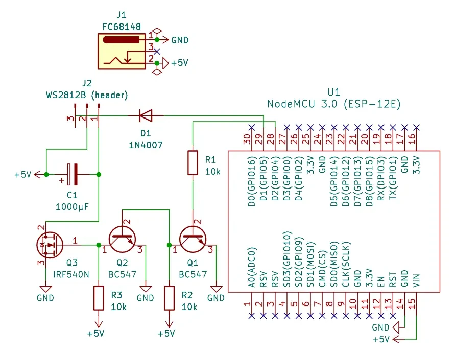

# Bulbs

Not mature yet project of RGB lights that can be controlled from your phone or local terminal.



# Applications

There are several clients available.

## bulbs-tui

TUI application written in rust created by [@mtvrsh](https://github.com/mtvrsh).

[Source](https://github.com/mtvrsh/bulbs-tui)

## bulbs-cli

CLI application written in python.

[Source](app-cli)

# Driver API

| Method  | Endpoint                                             | Usage                | Returns                                       |
| ------- | ---------------------------------------------------- | -------------------- | --------------------------------------------- |
| **GET** | `/led`                                               | Get LED status       | [status](#status-object)                      |
| **GET** | `/led/on`                                            | Get LED power status | `true` if LED power is ON, `false` otherwise  |
| **PUT** | `/led/on`                                            | Power on LEDs        |                                               |
| **GET** | `/led/off`                                           | Get LED power status | `true` if LED power is OFF, `false` otherwise |
| **PUT** | `/led/off`                                           | Power off LEDs       |                                               |
| **GET** | [`/led/color`](#get-ledcolor)                        | Get LED color        | [color](#color-object)                        |
| **PUT** | [`/led/color/{value}`](#put-ledcolorvalue)           | Set LED color        |                                               |
| **GET** | [`/led/brightness`](#get-ledbrightness)              | Get LED brightness   | [brightness](#brightness-object)              |
| **PUT** | [`/led/brightness/{value}`](#put-ledbrightnessvalue) | Set LED brightness   |                                               |

## Installation

Make sure you have `just`, `python` and `pip` installed. From [api](api) directory:

1. Install dependencies

```bash
just
```

2. [Flash](https://docs.micropython.org/en/latest/esp8266/tutorial/intro.html) MicroPython on your ESP8266 board

```bash
# Your board should be accessible from /dev/ttyUSB0 

just flash <your-firmware-release.bin>
```

3. Install API

```bash
just sync
```

4. Reboot the board

## Usage

### **GET** `/led/color`

**Request**

No parameters needed.

**Response**

On success, `200 OK` and [`color`](#color-object) object.

**Example**

Request

```sh
curl http://$DEVICE_IP/led/color
```

Response `200 OK`

```json
{
	"color": "#000000"
}
```

### **PUT** `/led/color/{value}`

**Request**

`Value` as hex color without leading `#`.

**Response**

On success, `200 OK`.

On invalid input, `400 Bad Request` with [message](#message-object) object.

**Example**

Request

```sh
curl -X PUT http://$DEVICE_IP/led/color/5a1010
```

Response `200 OK`

### **GET** `/led/brightness`

**Request**

No parameters needed.

**Response**

On success, `200 OK` and [`brightness`](#brightness-object) object.

**Example**

Request

```sh
curl http://$DEVICE_IP/led/brightness
```

Response `200 OK`

```json
{
	"brightness": 1.0
}
```

### **PUT** `/led/brightness/{value}`

**Request**

`Value` as number from `0` to `1`.

**Response**

On success, `200 OK`.

On invalid input, `400 Bad Request` with [message](#message-object) object.

**Example**

Request

```sh
curl -X PUT http://$DEVICE_IP/led/brightness/0.5
```

Response `200 OK`

---

### Status object

| Key        | Value type | Value description  |
| ---------- | ---------- | ------------------ |
| on         | boolean    | Power state        |
| color      | string     | Hex color          |
| brightness | float      | Number from 0 to 1 |

### Color object

| Key       | Value type | Value description |
| --------- | ---------- | ----------------- |
| color     | string     | Hex color         |

### Brightness object

| Key        | Value type | Value description  |
| ---------- | ---------- | ------------------ |
| brightness | float      | Number from 0 to 1 |

### Message object

| Key       | Value type | Value description      |
| --------- | ---------- | ---------------------- |
| message   | string     | Activities description |
